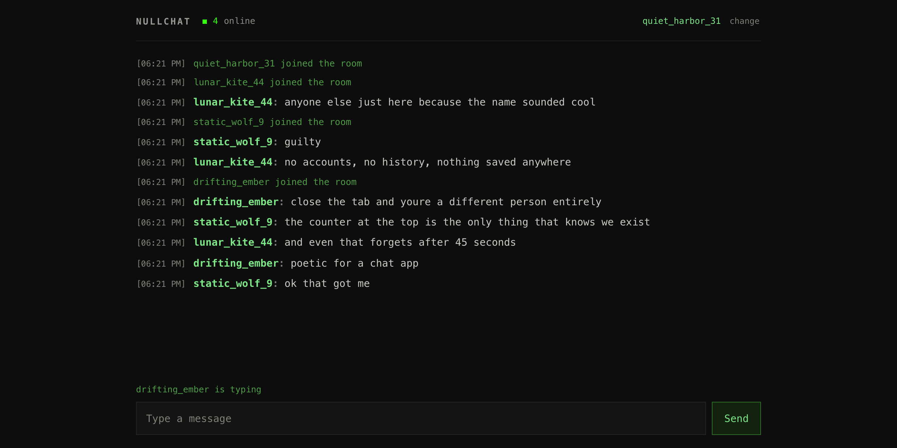
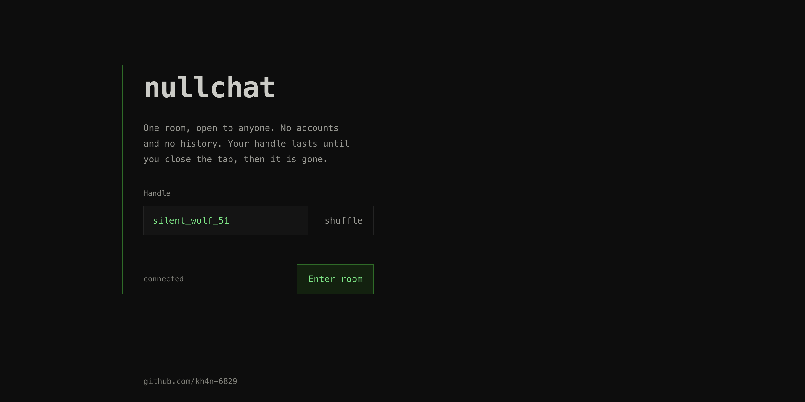

# nullchat

An anonymous chatroom that forgets you. One room, open to anyone, no accounts,
no history. You get a throwaway handle when you arrive and it stops existing
when you close the tab.

**Live at [nullch4t.](https://nullch4t.vercel.app)**

---

## What it is

One global room. You are handed a random handle like `quiet_harbor_31`, you can
change it to anything you like, and you start talking. There is no sign up, no
password, no email, and no profile.

Nothing you send is saved. Messages exist only long enough to be delivered to
whoever is connected at that moment. Arrive five minutes late and you have
missed the conversation permanently, because it was never written down.

Refresh the page and you come back as a different person. That is not a bug in
the session handling, it is the entire idea.

---

## What it never keeps

| | |
| --- | --- |
| **Messages** | Delivered and discarded. Never written to a database, a file, or a log. There is no history to read, leak, subpoena, or sell. |
| **Accounts** | None exist. No email, no password, no profile, nothing to breach. |
| **Your handle** | Lives in your browser tab's memory and in the RAM of whichever server is holding your connection. Close the tab and both copies are gone. |
| **Cookies / localStorage** | Not used for identity. The site stores nothing on your device, which is why a refresh makes you a new person. |
| **Who said what** | Not recorded anywhere. Once a message is delivered, no record connects it to you. |

---

## What it does store, briefly

Being straight about this, because "we store nothing" is almost never fully
true.

**A presence set.** To show the online counter, each connection adds an entry
to a Redis sorted set. The entry is an opaque id like `7f3a91c2:4d8e...`, a
random value with no link to your handle or to you. It carries a timestamp and
is deleted 45 seconds after the connection stops responding.

**A short lived name key.** When you disconnect, your handle is held in Redis
for up to 20 seconds under a key that expires on its own. This exists so that a
dropped connection which immediately reconnects does not spam the room with
"left" and "joined". It is the one place a handle touches storage, it is never
read by anything except that check, and it deletes itself.

That is the complete list.

---

## What this does not protect you from

Equally important, and usually left out.

**It is not end to end encrypted.** Traffic is encrypted in transit with TLS,
but the server processes messages in plaintext in order to relay them. Anyone
with access to the running server could read messages as they pass through.
This protects you from a permanent record, not from the operator.

**The host still sees connections.** nullchat logs no IP addresses. The
platform it runs on keeps its own infrastructure logs, as every web host does.
Anonymous here means no identity in the application, not invisibility on the
internet.

**The room is public.** Everyone connected reads everything. There are no
private messages and no private rooms.

**One tab per device is a convenience, not a control.** A second tab is blocked
so the online count stays honest. A different browser, a private window, or
another device is a different user, and nothing in a web page can prevent that.

**There is no moderation.** No accounts and no logs also means no way to trace
or remove anything. That tradeoff is deliberate, and it is a real one.

---

## How it works

Express and the `ws` package, running as a Vercel Function, with Upstash Redis
linking the instances together.

**Messages** are published to a Redis Pub/Sub channel. Every server instance
subscribes and fans each message out to the browsers connected to it. Pub/Sub
delivers to whoever is listening right now and keeps nothing, which is what
makes "no history" the default rather than a feature that had to be built.

**The online counter** uses a Redis sorted set scored by heartbeat timestamp.
Each instance refreshes its own connections every 15 seconds and evicts
anything older than 45 seconds before counting. An instance that dies without
cleaning up ages out instead of inflating the number forever.

**Connections drop about every 5 minutes**, because that is the Vercel function
duration cap. The browser reconnects with backoff and rejoins silently, and the
"left the room" notice is held for 10 seconds so a reconnect can cancel it.
You should never see this happen.

**Input is sanitised twice.** The server strips control characters and angle
brackets before publishing anything, and the browser builds every message node
with `textContent`, so no user string ever reaches `innerHTML`. Doing it server
side too means a hand written client that skips the browser entirely still
cannot inject markup. Messages are capped at 500 characters and each connection
is limited to 12 messages per 10 seconds.

---

Built by [kh4n-6829](https://github.com/kh4n-6829).
